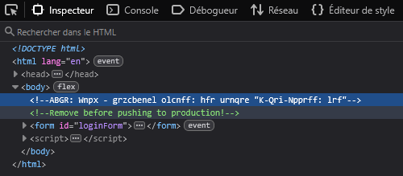
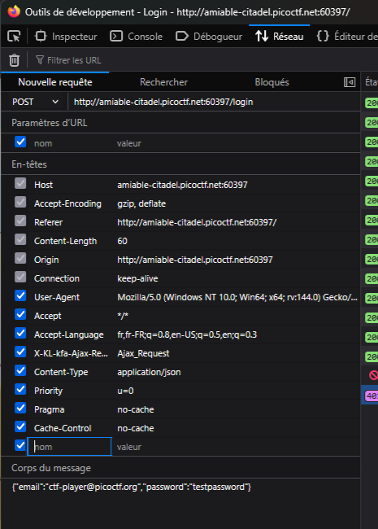

# Crack the Gate 1
* Difficulty : easy
* Tag : Web Exploitation
* Author : Yahaya Meddy

For this challenge I used Mozilla Firefox's browser inspector.

## Looking for clues

Let's run the webstite first. We stumble on a login page, asking for an email and a password. The email is provided by the challenge, it's `ctf-player@picoctf.org`, now we just need the password.

Could brute force work here ? I doubt it's the goal of this challenge, but it doesn't hurt to try some common passwords like : password, password123, azerty, .... Of course, it doesn't work :(

Let's inspect the website in our browser then. We immediately see this particular line from the HTML inspector :

There's this suspicious comment that looks like alphabet shifting to me. 

I use dencode.com, a website that automatically tries to decode an input string in different ways. We get ` NOTE: Jack - temporary bypass: use header "X-Dev-Access: yes" ` when decoding from `ROT13`.

For those who are unfamiliar with web, `X-` is a prefix that used to be recommended in HTTP Headers (it is not anymore). So we should head towards HTTP requests !

## Login attempt

Let's check what happens in the `Network` tab of our browser inspector when we try to log in with a random password.

See how the login attempt was made with a POST request ? The state is "401 Unauthorized", and in the Response tab we see :

    success:false
    error:"Unauthorized access."

(If the state is blocked, check that your CTF instance is still running !)

We can also see in the request header some fields prefixed with "X-". So, how to add `"X-Dev-Access: yes"` in the header of the same request to bypass the password check ?

Click on "Resend", on the top right of the Header tab (sorry for being French). A tab for a New Request opens :

You can add at the bottom `"X-Dev-Access` and `yes`, and send the request. The state of this request is `200 OK` so it worked ! Let's check the `Response` tab. The flag is here !

And voilà ! Thanks for reading ! 🤓